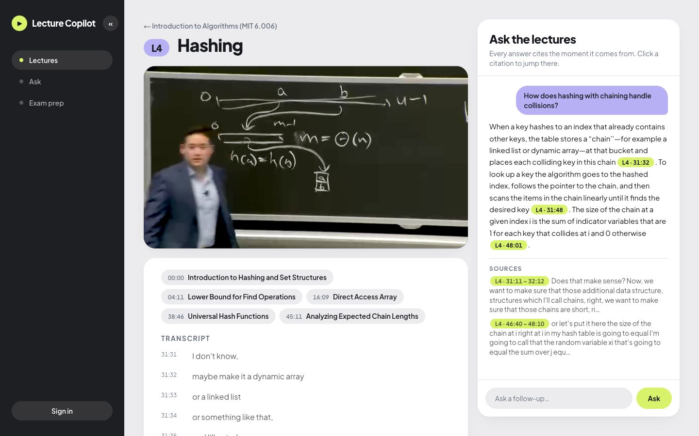
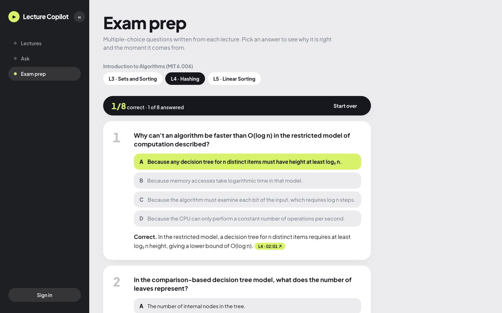
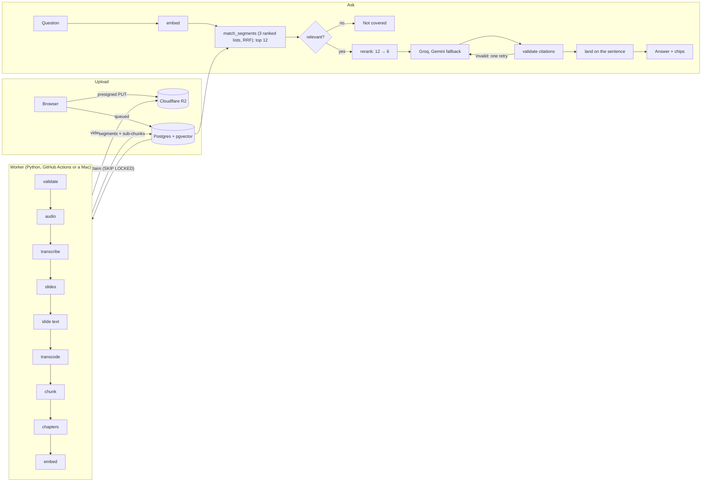

# Lecture Copilot

Ask a question about a lecture video and get an answer where every sentence cites the moment it comes from, like `L4 · 31:32`. Clicking the citation moves the video to that second.

**Live demo:** https://lecture-copilot.monishpatalay.dev (three MIT 6.006 lectures, no sign-in needed to ask)



In the screenshot the answer cites `L4 · 31:32`, and the transcript line at 31:32 is where the lecturer says it ("maybe make it a dynamic array or a linked list").

## What it does

| For students | For professors |
|---|---|
| **Ask** a lecture or a whole course. Answers stream in, cite their sources and say "Not covered in these lectures" when the lectures don't answer the question. | **Upload** a video in the browser (MP4, MOV or WebM, up to 2 GB and 3 hours). It is transcribed, chaptered and indexed without anyone's laptop being on. |
| **Follow up** ("why?", "explain that more simply") and the earlier exchange is taken into account. | **Insights**: what students ask, which questions the lectures didn't cover, which answers got a thumbs down, and the most-cited moments. |
| **Exam prep**: multiple-choice questions written from each lecture, scored, each linking to the moment that explains the answer. A wrong-looking question can be reported. | **Exam prep editing**: correct or delete individual questions, see which ones students reported, or have a new set written. |
| **Rate answers** with a thumbs up or down. | **Manage**: rename or delete courses and lectures. Uploading is invite-only: people request access and the admin approves. |



## How it works



**Processing a lecture.** The worker claims a queued lecture with `FOR UPDATE SKIP LOCKED` (Postgres is the job queue; there is no Redis) and runs one stage per file in `worker/lecture_worker/stages/`. Each stage leaves a marker, so a failed run resumes where it stopped. Speech is transcribed with Whisper large-v3-turbo (locally through MLX on Apple Silicon, or through Groq's hosted Whisper on the cloud worker). Slide frames are found by scene detection and read by Gemini. The transcript is cut into 60–90 second segments that end on a sentence, and each segment is also cut into ~20 second sub-chunks; both are embedded with `gte-small` (384 dimensions).

**Answering a question.**

1. The question is embedded by a Supabase Edge Function running the same `gte-small` weights the worker used (a parity test checks the two agree).
2. `match_segments`, one SQL function, ranks segments three ways (the segment's own vector, its best sub-chunk's vector, and full-text search) and merges the three lists with reciprocal rank fusion. It returns the top twelve.
3. If the best cosine similarity is under 0.78, the answer is "Not covered in these lectures" and no model is called.
4. A small, fast model (Gemini's lite model) reads the twelve passages against the question and keeps the six most likely to hold the answer, best first. It has three seconds; if it is slow, over its free quota or replies with nonsense, the search order is used unchanged.
5. Groq (`openai/gpt-oss-120b`) writes the answer from those six segments only, ending every sentence with a citation. On a rate limit or outage the same prompt goes to Gemini.
6. **Citations are checked in code, not trusted.** Each must name a retrieved segment and a time inside it. An answer that fails is regenerated once with the reason; if it fails again the user gets an error, never an unverified citation.
7. Each citation is then moved from the start of its segment to the stretch of transcript that shares the most distinctive words with the sentence it supports, so the click lands on the sentence.

Follow-ups are first rewritten into a standalone question using the last three exchanges, then go through the same steps.

## Evaluation

`evals/questions.jsonl` has 150 questions over the three demo lectures: 120 with a gold passage (lecture and time span) and 30 the lectures do not cover. `evals/run_eval.py` measures four things, and CI runs the first on every push and fails if recall@3 drops more than 3 points.

**Retrieval** (120 covered questions; a hit is a retrieved segment that overlaps the gold passage):

| | Search only | As served, after reranking |
|---|---|---|
| Right segment ranked first (recall@1) | 0.692 | **0.800** |
| In the top 3 (recall@3) | 0.833 | **0.892** |
| In the top 6, which is what the answer model reads (recall@6) | 0.933 | **0.950** |
| Mean reciprocal rank | 0.774 | **0.854** |

"As served" is measured through the app itself, so it includes the reranker's failures: on the free tier about a third of rerank calls took longer than the three-second cap and those questions kept search order. In an earlier run, with a slower reranker model and fewer timeouts, the same four numbers were 0.867, 0.933, 0.958 and 0.904, which is closer to what the reranker can do when it answers in time.

Earlier steps, for the record: adding 20-second sub-chunks as a third ranked list moved recall@1 from 0.633 to 0.692 and left the top six unchanged. Reweighting the lists, pool sizes, a different full-text ranking, lecture-title prefixes and two small Groq models as rerankers were tried and did not beat noise.

**End to end** (a fixed 30-question subset: 20 covered, 10 not; every answer written by the primary model):

| | Result |
|---|---|
| Answers whose citations all passed the code check | 1.00 |
| Answered questions that cite the gold segment | 0.84 |
| Right call on covered vs not covered | 0.97 (one covered question was refused) |
| Latency, full answer (p50 / p95) | 1.78 s / 4.02 s |

Reranking roughly doubled the median answer time (it was 0.97 s). Answers stream, so the first words arrive sooner than that.

**Faithfulness** (35 cited sentences from those answers, each judged against the passage it cites by a second model from a different family):

| Verdict | Share |
|---|---|
| Supported: the passage says it | 60% |
| Partly: the passage says some of it, or the sentence adds a detail | 40% |
| Unsupported | 0% |

**Where citations land** (21 citations of gold segments in that run):

| | Segment start (before) | Sentence-level (now) |
|---|---|---|
| Lands inside the gold passage | 48% | **95%** |
| Mean distance from the gold passage | 10.3 s | **0.1 s** |

**A second lecture.** `evals/questions_dsa.jsonl` has 32 questions for a different kind of lecture (a 75-minute slide-based interview-prep video, 26 covered questions). Search alone ranks the right segment first for 92% and in the top three for 100%. Those questions were written close to the transcript's wording, which makes them easier than the MIT set. That video's transcript is not in this repository, so the set runs against a deployment that has the lecture.

**How much to trust this.** The questions and gold passages were written by an AI model from the transcripts. A second model checked every gold passage against its question: 117 of 120 answer it, 3 partly, 0 not at all. That is a machine check, not a person: `evals/review_sheet.md` lists 30 of the questions with their passages for a human reviewer, and nobody has gone through it yet. The sample is small (a difference of one or two questions is noise), the faithfulness judge is itself a model, and the design choices were made on this same set, so the gains are likely a little optimistic.

## Design decisions

- **Citations are validated, then refined.** The model can't invent a timestamp: the check is a pure function with tests, and it accepts the bracket and spacing variants models actually produce.
- **A relevance gate before the model.** Rank fusion scores only reflect rank, so the gate uses cosine similarity. It was tuned so no covered eval question is blocked.
- **Postgres is the queue.** Claims use `SKIP LOCKED`, a heartbeat renews the lock, stale locks are requeued and abandoned uploads expire. The worker talks only to Postgres and R2, never to the web app.
- **Everything has a free-tier fallback.** Groq falls back to Gemini for answers; slide reading falls back to a lighter Gemini model; the cloud worker uses hosted Whisper and the Edge Function for embeddings so it needs no GPU.
- **Rerank, with a way out.** Reranking is the single biggest retrieval gain measured here, but it adds a model call on a small free quota. It is capped at three seconds and never blocks an answer.
- **Generated exam questions are checked and still editable.** A second, blind pass answers each generated question from its passage and drops the ones where it disagrees with the marked answer. That catches contradictions, not every mistake, so professors can edit and students can report.
- **Row-level security does the gating.** The web app reads as the signed-in viewer; the service role is used only for the few writes that have no public policy.

## Stack and cost

Next.js 16 (App Router, React 19, Tailwind v4) on Vercel · Supabase Postgres with pgvector, Auth (magic link) and an Edge Function · Cloudflare R2 for video · Python 3.12 worker run with `uv`, on GitHub Actions or a Mac · ffmpeg · Whisper large-v3-turbo · `gte-small` embeddings · Groq and Gemini through their OpenAI-compatible endpoints.

It runs on free tiers: **$0 a month**. The limits that matter are Groq's (about four questions a minute before the Gemini fallback takes over, and two hours of audio transcription per hour).

Processing time for a 52-minute lecture: 7 min 20 s on an M4 MacBook, and 19 minutes on the GitHub Actions worker in the one full-length run so far, 11 minutes of which was a stalled Gemini request (requests now time out after two minutes).

## Run it locally

Needs Docker, the Supabase CLI, Node 24 with pnpm, `uv` and ffmpeg. The full worker (local Whisper) needs Apple Silicon.

```bash
cp .env.example .env            # fill in the R2, Groq and Gemini keys; supabase start prints the rest
supabase start                  # Postgres, Auth, the embed function; applies migrations and the demo course
cd web && pnpm install && pnpm dev

# process a lecture from disk
cd worker && uv run python -m lecture_worker.process lecture.mp4 \
  --course-id 00000000-0000-0000-0000-000000000001 --number 1 --title "My lecture"
# or run the queue worker for browser uploads
uv run python -m lecture_worker.worker
```

To upload through the browser locally, sign in (the email lands in Mailpit at http://127.0.0.1:54324), then run `select make_instructor('you@example.com');` in SQL.

Tests: `cd web && pnpm test` (unit) · `pnpm e2e` (browser tests, against a running app) · `cd worker && uv run pytest` (needs `supabase start`) · `python3 evals/run_eval.py`.

Responses carry a content security policy and the usual security headers (`web/next.config.ts`). Visitors get 20 questions a day per course and signed-in users 200.

## Layout

```
web/                    Next.js app
  app/                  pages, API routes (ask, lectures, courses) and server actions
  lib/                  answer.ts, citations.ts, refine.ts, followup.ts, llm.ts, practice.ts, insights.ts (+ tests)
worker/lecture_worker/  queue worker, CLI and one file per pipeline stage
supabase/               migrations (schema, RLS, match_segments) and the embed Edge Function
evals/                  questions, runner, recorded results and the CI fixture
.github/workflows/      ci.yml (tests + retrieval eval) and process.yml (the cloud worker)
```

## Known limits

- Tested on three blackboard lectures from one course. Slide-heavy lectures run through the same pipeline but have not been evaluated.
- A lecture longer than about two hours exceeds Groq's free hourly transcription allowance. Processing pauses with a message, and Retry an hour later carries on from the saved parts.
- The reranker and the answer fallback share Gemini's free tier (500 requests a day for the lite model). Past that, answers still work, in search order and without the fallback.
- Generated exam questions can still be wrong, mostly by attributing a result to the wrong algorithm on maths-heavy lectures. They are a draft for the professor to review.
- Citations that are refined by word overlap can miss when an answer paraphrases heavily; they then stay at the segment start.
- Private courses exist in the data model, but there is no screen for adding members yet.

## Credits

The demo lectures are from MIT 6.006 Introduction to Algorithms, Spring 2020 (Erik Demaine, Jason Ku, Justin Solomon), MIT OpenCourseWare, https://ocw.mit.edu, licensed CC BY-NC-SA 4.0. Transcripts shown in the app were produced by automatic speech recognition and are not official.
